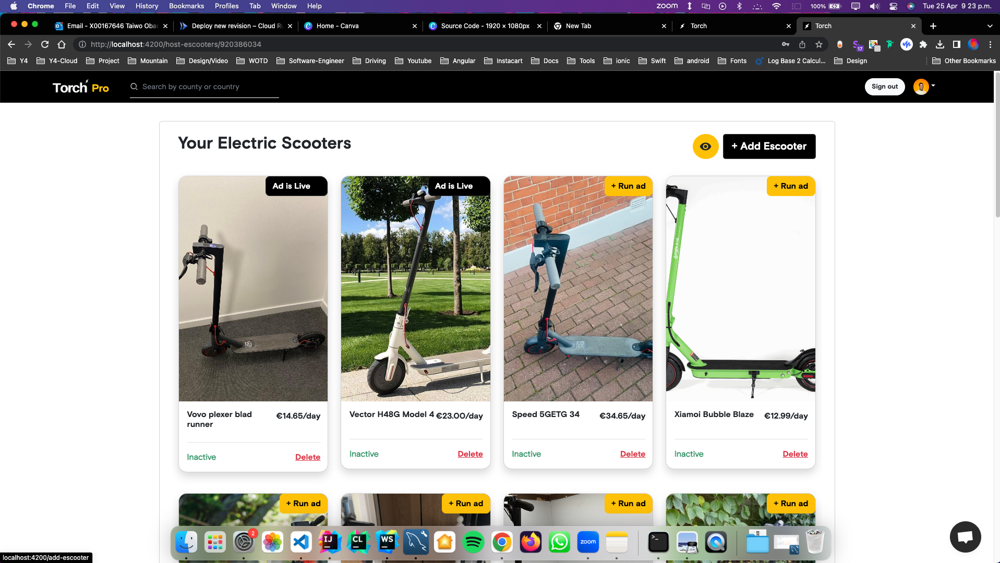
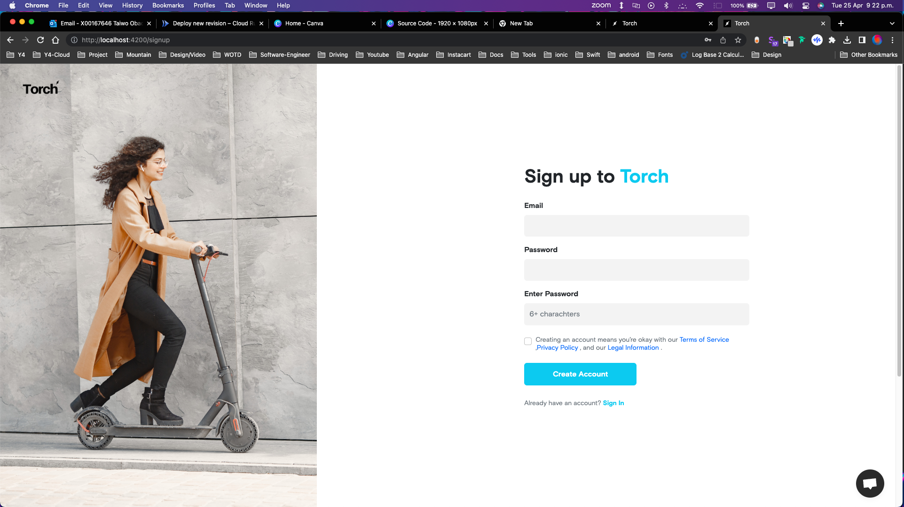

#  Torch

## Live Site

Check out the live site [here](https://torch-front-end-wfurmbodqa-nw.a.run.app/).
View images here: [Images](#Images)

## Table of Contents
1. [Project Name](#project-name)
2. [Project Description](#project-description)
3. [Application Data](#application-data)
4. [Software Consumers](#software-consumers)
5. [Technical Complexity](#technical-complexity)
6. [Deployment Service](#deployment-service)
7. [Development Framework](#development-framework)
8. [Images](#Images)

## Project Name
RentYourScooter.com (Torch)

## Project Description
This app is designed to function similarly to the popular Turo app, allowing users to rent out their electric scooters. Users can also rent scooters from others. The application aims to integrate Google Maps for an enhanced user experience.

## Application Data
The application data is stored in a relational MySQL database. At a high level, it includes:

- **Trip**: owner, lender, cost per day (calculated with insurance), etc.
- **User**: user_id, name, age, review, etc.
- **Vehicle**: user_id, range, cost, date released, speed, location_longitude, location_latitude, etc.
- **Insurance**: name, cost, etc.

## Software Consumers
The application is planned to be web-based.

## Technical Complexity
The project includes several complex features:

- The app integrates with google maps that will give a pinpoint accurate representaion of where the scooter is located on the map
- Host users will be allowed to promote the application using an ad campaign for up to three days, this will boost the chances of a host to get their scooter rented out.
- A review functionality that allows riders to write reviews and provide a star rating based on their renting experience to both the host and the scooter in question.
- Hosts will have access to specific parts of the app.
- Users can apply for basic, advanced, or premium service to provide to them credits/days of ad days to promote the electric scooter
- We will also implement an multi-filter algorithim that allows users to filter electric scooter based on different scooter properties.
- We intetrate an API that heps retrieve the user longitude and latidue scooter location search, then we use the Harversial formulae to calculate distance that is withing 15 kilometers of the search point.

## Deployment Service
The application is hosted on the google cloud platform. The application uses a host of services that will help perform the business logic provided by Torch. Stripe will be used to facilitate payments and with monthly subscription services. Google cloud buckets will host all our user images and provide to us a stateless way of running our containerised environment. Gmail will be used to facilitate the email verification we will send to the user. Geoaplify will allow us to get the google maps data from the user and give us the necessary details we about the user location such as longitude and latitude values. 

## Development Framework
The following development framework will be used:

- Spring Boot
- Angular
- Bootstrap
- CSS Grid/FlexBox
- HTML
- Hibernate
- Spring Data JPA
- Spring Security
- Lombok
- FreeMarker (Email)

## Images

